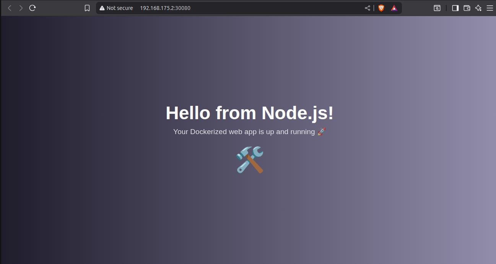

# 👋 Hello from Node Monitor App

This is a small project I built using JavaScript and Docker. It runs a tiny web server and shows a nice page in your browser.

---

## 🌈 What It Looks Like

Here’s a picture of the app:



---

## 🔨 How to Use It

### 🧪 Run with Node:

```bash
node index.js

Then go to http://localhost:3000

🐳 Run with Docker:

docker build -t node-monitor-app .
docker run -p 3000:3000 node-monitor-app

☸️ Run on Kubernetes:

eval $(minikube docker-env)
docker build -t node-monitor-app .

kubectl apply -f k8s/deployment.yaml
kubectl apply -f k8s/service.yaml

minikube service node-monitor-service

🎯 Why I Made This
I wanted to learn DevOps, Docker, and Kubernetes by building something real and simple.

🧑‍💻 Made By
Bala – learning by doing! 😊

Now press:
- `CTRL + O` → to save
- `Enter` → to confirm
- `CTRL + X` → to close nano

---

### 🟢 Step 5: Save and Upload to GitHub

Now upload your file and screenshot to GitHub:

```bash
git add README.md screenshot.png
git commit -m "Add simple README with screenshot"
git push origin main

🎉 DONE!
Now go to your GitHub page → You’ll see your new README file and picture!

